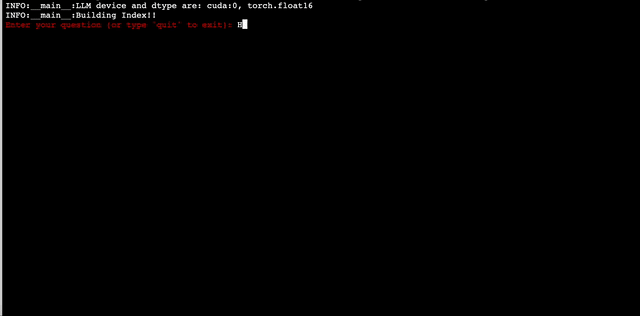

# Code Explainer with Retrieval-Augmented Generation (RAG)

This repository contains a Python script that leverages the power of Retrieval-Augmented Generation (RAG) to explain and understand code snippets. It integrates Transformers, LLaMA index, Langchain embeddings, and custom embeddings to provide comprehensive and understandable explanations of code.


## Example 1

<p align="center">
  
</p>

## Example 2

<p align="center">
  
</p>


## Features

- **Transformers Integration**: Uses AutoModelForCausalLM and AutoTokenizer from the Hugging Face's Transformers library.
- **Efficient Indexing with LLaMAIndex**: Utilizes VectorStoreIndex and SimpleDirectoryReader for efficient indexing and retrieval.
- **Custom Embeddings**: Supports Sentence Transformers, BGE, UAE, and Instructor embeddings for better understanding and contextual representation of code.
- **Flexible Configuration**: Argument parsing allows for easy customization and control over the script's behavior.

## Prerequisites

Before you begin, ensure you have the following requirements:

- Python 3.x
- Pip (Python package installer)

## Installation

Clone the repository to your local machine:

```bash
git clone https://github.com/Asad-Ismail/RAG_CODE-QA.git
```

Install requriements:

```bash
pip install -r requirements.txt
```

## Ask Questions

```bash
python run.py --input_dir <path_to_scripts> --embed_device <device> --llm_device <device> --model_name <model_name> --embedding_choice <embedding_type>
```


